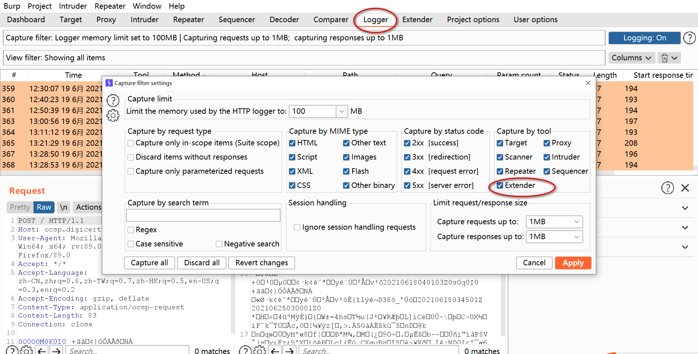
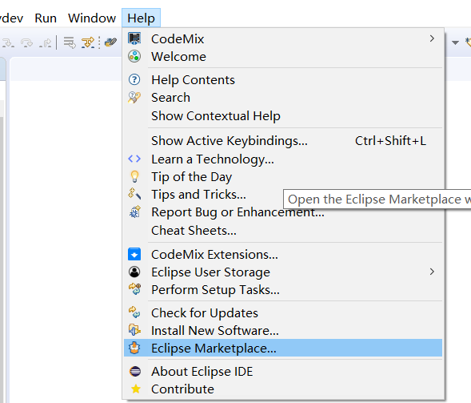
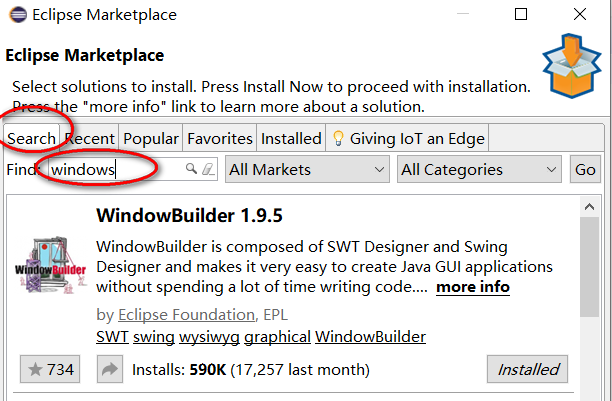
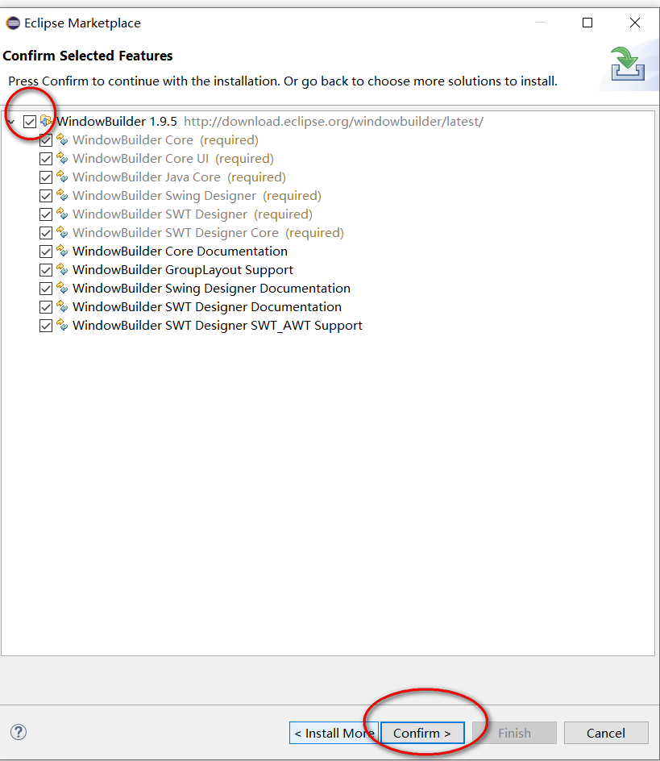
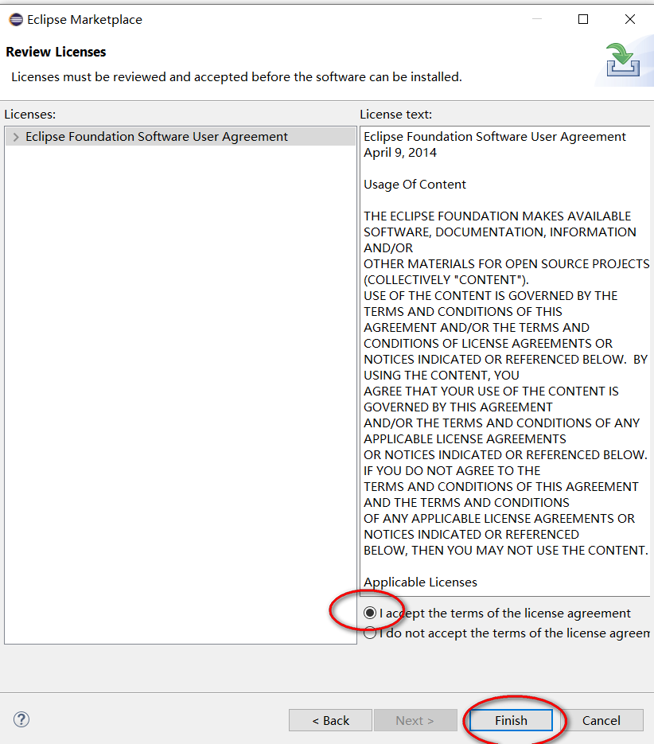
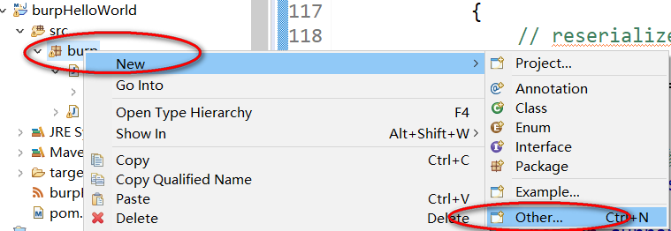
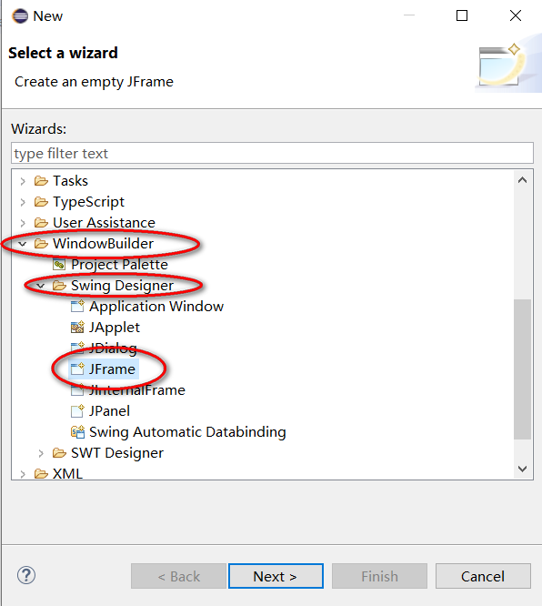
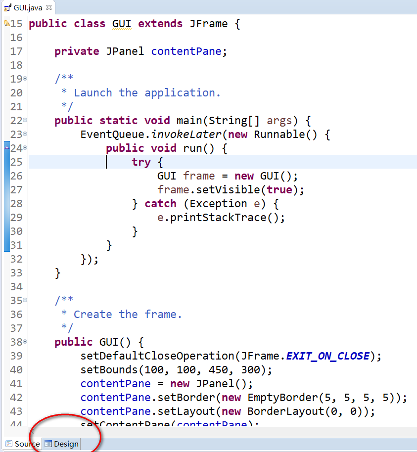
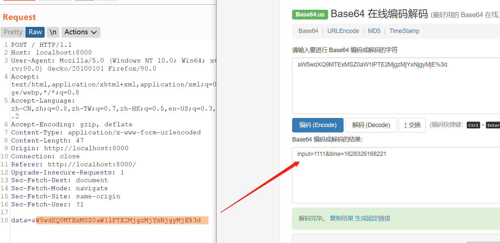

# burp api drops

API快速索引 ：

| burp api                         | 相关课程                                         | 示例代码                                                     |
| -------------------------------- | ------------------------------------------------ | ------------------------------------------------------------ |
| IBurpCollaboratorClientContext   | 十、自定义扫描插件的开发                         | https://github.com/PortSwigger/example-scanner-checks/       |
| IBurpCollaboratorInteraction     | 十、自定义扫描插件的开发                         | https://github.com/PortSwigger/example-scanner-checks/       |
| IBurpExtender                    | 二、开发环境准备和Hello World                    | https://github.com/PortSwigger/example-hello-world           |
| IBurpExtenderCallbacks           | 二、开发环境准备和Hello World                    | https://github.com/PortSwigger/example-hello-world           |
| IContextMenuFactory              | 六、访问burp中的关键数据                         | https://github.com/bit4woo/knife<br />https://github.com/bit4woo/burp-api-drops/blob/master/src/burp/Lession6.java |
| IContextMenuInvocation           | 六、访问burp中的关键数据                         | https://github.com/bit4woo/knife<br />https://github.com/bit4woo/burp-api-drops/blob/master/src/burp/Lession6.java |
| ICookie                          |                                                  |                                                              |
| IExtensionHelpers                | 五、HTTP数据包的处理                             | https://github.com/PortSwigger/example-traffic-redirector<br />https://github.com/PortSwigger/custom-logger |
| IExtensionStateListener          |                                                  | https://github.com/PortSwigger/example-event-listeners       |
| IHttpListener                    | 四、学习思路和核心逻辑<br />五、HTTP数据包的处理 | https://github.com/PortSwigger/example-event-listeners<br />https://github.com/PortSwigger/custom-logger |
| IHttpRequestResponse             | 五、HTTP数据包的处理                             | https://github.com/PortSwigger/example-traffic-redirector<br />https://github.com/PortSwigger/custom-logger |
| IHttpRequestResponsePersisted    |                                                  |                                                              |
| IHttpRequestResponseWithMarkers  | 十、自定义扫描插件的开发                         | https://github.com/PortSwigger/example-scanner-checks/       |
| IHttpService                     | 五、HTTP数据包的处理                             | https://github.com/PortSwigger/example-traffic-redirector    |
| IInterceptedProxyMessage         |                                                  | https://github.com/bit4woo/knife/blob/master/src/burp/BurpExtender.java |
| IIntruderAttack                  |                                                  |                                                              |
| IIntruderPayloadGenerator        | 十一、自定义Intruder Payloads                    | https://github.com/PortSwigger/example-intruder-payloads<br />https://github.com/bit4woo/reCAPTCHA |
| IIntruderPayloadGeneratorFactory | 十一、自定义Intruder Payloads                    | https://github.com/PortSwigger/example-intruder-payloads<br />https://github.com/bit4woo/reCAPTCHA |
| IIntruderPayloadProcessor        | 十一、自定义Intruder Payloads                    | https://github.com/PortSwigger/example-intruder-payloads<br />https://github.com/bit4woo/reCAPTCHA |
| IMenuItemHandler                 |                                                  |                                                              |
| IMessageEditor                   | 八、IMessageEditorTab                            | https://github.com/PortSwigger/custom-logger                 |
| IMessageEditorController         | 八、IMessageEditorTab                            | https://github.com/PortSwigger/custom-logger                 |
| IMessageEditorTab                | 八、IMessageEditorTab                            | https://github.com/bit4woo/u2c<br />https://github.com/PortSwigger/example-custom-editor-tab |
| IMessageEditorTabFactory         | 八、IMessageEditorTab                            | https://github.com/bit4woo/u2c<br />https://github.com/PortSwigger/example-custom-editor-tab |
| IParameter                       | 五、HTTP数据包的处理                             |                                                              |
| IProxyListener                   |                                                  | https://github.com/PortSwigger/example-event-listeners       |
| IRequestInfo                     | 五、HTTP数据包的处理                             | https://github.com/bit4woo/burp-api-drops/blob/master/src/burp/Lession5.java |
| IResponseInfo                    | 五、HTTP数据包的处理                             | https://github.com/bit4woo/burp-api-drops/blob/master/src/burp/Lession5.java |
| IResponseKeywords                |                                                  |                                                              |
| IResponseVariations              |                                                  |                                                              |
| IScanIssue                       | 十、自定义扫描插件的开发                         | https://github.com/PortSwigger/example-scanner-checks        |
| IScannerCheck                    | 十、自定义扫描插件的开发                         | https://github.com/PortSwigger/example-scanner-checks        |
| IScannerInsertionPoint           | 十、自定义扫描插件的开发                         | https://github.com/PortSwigger/example-custom-scan-insertion-points |
| IScannerInsertionPointProvider   | 十、自定义扫描插件的开发                         | https://github.com/PortSwigger/example-custom-scan-insertion-points |
| IScannerListener                 |                                                  | https://github.com/PortSwigger/example-event-listeners       |
| IScanQueueItem                   |                                                  |                                                              |
| IScopeChangeListener             |                                                  |                                                              |
| ISessionHandlingAction           | 七、ISessionHandlingAction的使用                 | https://github.com/PortSwigger/example-custom-session-tokens<br />https://github.com/bit4woo/burp-api-drops/blob/master/src/burp/Lession7.java |
| ITab                             | 九、自定义UI界面                                 | https://github.com/PortSwigger/custom-logger                 |
| ITempFile                        | 十二、插件配置的保存和其他                       |                                                              |
| ITextEditor                      |                                                  |                                                              |


# 一、Burp插件介绍和编程语言选择


## 插件是什么？

扩展burp功能的程序，依赖burp提供的API，让使用者可以开发一些自己想要的功能。


## 插件可以干什么？

请求和响应包的修改：比如在每个请求包中加如自定义的header

自定义UI界面：插件可以实现一个自己的tab，方便图像化操作

自定义扫描插件：当出现了新的漏洞，我们就可以编写自己的扫描插件，来自动化发现这类漏洞

访问burp中的一些关键数据：比如proxy中的请求记录、sitemap中请求响应、扫描发现的漏洞（issue）


## 插件怎么使用？

先讲burp插件的基本使用：加载安装、卸载、排序

插件的加载，可以从burp官方的BApp Store中进行加载安装


也可加载一些外部插件。


加载后burp才会起作用，可以通过点击这个选择框来启用或禁用插件。


值得注意的是：图形界面中的顺序，就是插件被调用的顺序！我们可以通过 Up或Down来调整插件的顺序。

当多个插件有相同的操作时，比如修改请求数据包，插件的顺序就可能影响最后的请求数据包的内容。

## 插件怎么开发？

这是我们这个系列课程的核心主题，后续的章节就是围绕这个主题进行的。


## 编程语言的选择

burp suite支持三种编程语言开发的插件:

- Java
- python
- ruby

我们选择Java，为什么选择Java？原因有三：

1、兼容性

之前也用python写过几个简单插件。遇到过一种情况，当需要调用的外部类包含遇到pyd文件就无法进行下去了，因为pyd是C写的，Jython是无法使用C写的模块的。burp本身是Java写的，使用Java去开发插件兼容性最高，会少很多莫名其妙的错误。


下面这个链接对此有详细说明：http://stackoverflow.com/questions/16218183/using-pyd-library-in-jython

2、调试

当使用python写插件进行调试时，只能尽量通过输出去获取信息，没有好的办法进行下断点动态调试。而Java 则可以，对于复杂逻辑的插件，Java编写的更容易排查问题。

3、打包

是burp写的插件可以打包成一个独立的Jar包，方便移动和传播，环境配置也更简单。


综上，Java是写burp插件的最佳的选择。


# 二、开发环境准备和Hello World

## 环境搭建

### JDK安装

在Oracle官网可以找到各种版本JDK的[下载地址](https://www.oracle.com/java/technologies/oracle-java-archive-downloads.html) ，我们选择[JDK8](https://www.oracle.com/java/technologies/javase/javase8u211-later-archive-downloads.html#license-lightbox)，并且将java.exe所在目录加入系统环境变量。

### IDEA 或 Eclipse

推荐使用IDEA，它的调试功能比较好用。

### maven

https://maven.apache.org/download.cgi


下载后解压，然后将mvn.cmd所在目录加入环境变量即可。

## 国际惯例hello world

https://github.com/PortSwigger/example-hello-world/blob/master/java/BurpExtender.java

### 依赖包的管理

```xml
<project xmlns="http://maven.apache.org/POM/4.0.0"
    xmlns:xsi="http://www.w3.org/2001/XMLSchema-instance"
    xsi:schemaLocation="http://maven.apache.org/POM/4.0.0 http://maven.apache.org/xsd/maven-4.0.0.xsd">
    <modelVersion>4.0.0</modelVersion>
    <groupId>com.bit4woo.burp</groupId>
    <artifactId>domain_hunter</artifactId>
    <version>1.4</version>
    <build>
        <sourceDirectory>src</sourceDirectory>
        <plugins>
            <plugin>
                <artifactId>maven-compiler-plugin</artifactId>
                <version>3.7.0</version>
                <configuration>
                    <source>1.8</source>
                    <target>1.8</target>
                </configuration>
            </plugin>

            <plugin>
                <artifactId>maven-assembly-plugin</artifactId>
                <configuration>
                    <descriptorRefs>
                        <descriptorRef>jar-with-dependencies</descriptorRef>
                    </descriptorRefs>
                    <archive>
                        <manifest>
                            <addDefaultImplementationEntries>
                                true<!--to get Version from pom.xml -->
                            </addDefaultImplementationEntries>
                        </manifest>
                    </archive>
                </configuration>
                <executions>
                    <execution>
                        <id>make-assembly</id>
                        <phase>package</phase>
                        <goals>
                            <goal>single</goal>
                        </goals>
                    </execution>
                </executions>
            </plugin>

        </plugins>
    </build>
    <dependencies>
        <!-- https://mvnrepository.com/artifact/net.portswigger.burp.extender/burp-extender-api -->
        <dependency>
            <groupId>net.portswigger.burp.extender</groupId>
            <artifactId>burp-extender-api</artifactId>
            <version>1.7.22</version>
        </dependency>

        <!-- https://mvnrepository.com/artifact/com.google.code.gson/gson -->
        <dependency>
            <groupId>com.google.code.gson</groupId>
            <artifactId>gson</artifactId>
            <version>2.8.6</version>
        </dependency>

        <!-- to get root domain -->
        <dependency>
            <groupId>com.google.guava</groupId>
            <artifactId>guava</artifactId>
            <version>29.0-jre</version>
        </dependency>

        <!-- https://mvnrepository.com/artifact/org.apache.commons/commons-text -->
        <dependency>
            <groupId>org.apache.commons</groupId>
            <artifactId>commons-text</artifactId>
            <version>1.6</version>
        </dependency>

        <!-- https://mvnrepository.com/artifact/org.beanshell/bsh -->
        <dependency>
            <groupId>org.beanshell</groupId>
            <artifactId>bsh</artifactId>
            <version>2.0b5</version>
        </dependency>
    </dependencies>
</project>
```

### 插件程序的规范

```java
package burp;

import java.io.PrintWriter;

public class BurpExtender implements IBurpExtender
{
    @Override
    public void registerExtenderCallbacks(IBurpExtenderCallbacks callbacks)
    {
        // 设置插件的名称
        callbacks.setExtensionName("Hello world extension");
        
        // 获取burp提供的标准输出流和错误输出流
        PrintWriter stdout = new PrintWriter(callbacks.getStdout(), true);
        PrintWriter stderr = new PrintWriter(callbacks.getStderr(), true);
        
        // 打印到标准输出流
        stdout.println("Hello output");
        
        // 答应到错误输出流
        stderr.println("Hello errors");
        
        // 写一个报警信息到burp的报警面板
        callbacks.issueAlert("Hello alerts");
        
        // 抛出一个异常，将会在错误输出流中显示
        throw new RuntimeException("Hello exceptions");
    }
}
```


- 所有的burp插件都必须实现IBurpExtender这个接口
- 实现类的包名称必须是burp
- 实现类的名称必须是BurpExtender
- 实现类比较是public的
- 实现类必须有默认构造函数（public，无参），如果没有定义构造函数就是默认构造函数

### callbacks对象的作用

通过 callbacks 这个实例对象，传递给插件一系列burp的原生方法。我们需要实现的很多功能都需要调用这些方法。


# 三、动态调试方法

## IDEA的配置


## burp端的启动参数

```
java -agentlib:jdwp=transport=dt_socket,server=y,suspend=n,address=5005 -jar burpsuite_pro_v2020.2.1.jar
pause
```

## 破解版burp的调试方法

国内我们用的burp版本大家都懂的，一般都是破解版（使用Keygen或者helper的都有），如果要使用破解版进行调试，可以使用如下命令行参数启动burp，然后运行burp的JVM将处于监听状态，5005端口。

```
java -agentlib:jdwp=transport=dt_socket,server=y,suspend=n,address=5005 -Xbootclasspath/p:burp-loader-keygen-70yeartime-BurpPro.jar -jar burpsuite_pro_v1.7.37.jar

java -agentlib:jdwp=transport=dt_socket,server=y,suspend=n,address=5005 -Xbootclasspath/p:BurpHelper2019.jar -jar burpsuite_pro_v1.7.37.jar
```

这个命令和正版不同的地方就是需要加 Xbootclasspath/p: 这一段，可以保存个bat，方便一键启动。

## 使用logger++分析数据包帮助调试

如果是写扫描插件、或者其他需要修改请求响应包的插件，我们可以使用logger++来帮助我们查看修改后的请求响应包。


## 使用burp的log功能帮助分析数据包

由于logger++有时会出问题，这里再推荐一种替代方案，就是通过burp的log功能，来帮助查看数据包。


比较新的版本中，日志功能还得到了加强，对我们的调试日志查看更加方便。



# 四、学习思路和核心逻辑

## 向官方文档和API学习

官方教学文档和API文档一定是最权威的，如果有问题，首先找官方文档。

官方各种示例代码：https://portswigger.net/burp/extender

官方API文档：https://portswigger.net/burp/extender/api/

比如选择有一个需求，要获取请求包的某个header的值，但是不知道怎么做，那么我们可以尝试在API中找关键词：


## 向已有的优秀插件学习

可以找BApp Store上的类似功能的插件，查看他们的源码，学习作者的实现思路。


如果是非官方的BApp Store的项目，还可以直接反编译它的Jar包，查看其代码，[JD-GUI](http://java-decompiler.github.io/)了解一下

## burp中的核心对象

burp中最为核心的对象就是HTTP数据包，我们的所有操作、各种API接口都是围绕HTTP数据包展开的。


## 插件的调用逻辑


以HttpListener为例说明一下【burp主程序】和【burp插件程序】之间的调用关系。

第一步：burp插件被加载时，【burp主程序】就会去调用BurpExtender类中的registerExtenderCallbacks方法。【burp插件程序】就是通过这个方法，在其中注册HttpListener，其目的就是告诉【burp主程序】当前HttpListener对象的存在。类似地，Factory等其他需要由burp主程序主动调用或通知的对象，也需要在这个函数中完成注册。

第二步：当【burp主程序】的某个组件产生了一个请求或者响应包（比如Proxy收到了一个来自浏览的请求，Scanner主动发起了一个扫描请求，Scanner收到了扫描请求的响应包等等）都会主动通知各个已知HttpListener对象。类似地，Factory等其他对象，也会在不同的场景下被通知或者别调用，比如ExtensionStateListener，会在burp插件取消加载的时候被通知。

第三步：【burp插件程序】中的HttpListener对象在收到通知信息后，执行自己特定的逻辑（processHttpMessage函数中），进行数据包的修改或者分析。类似地，其他对象也都有实现自己逻辑的函数。

## 需要主动注册的对象

他们的共通特定是：会被burp主程序主动调用或者主动通知，burp主程序必须知道它们的存在，才能完成对应的功能。

### 各种事件监听器

ExtensionStateListener

HttpListener

ProxyListener

ScannerListener

ScopeChangeListener

### 各种对象构造工厂

ContextMenuFactory

MessageEditorTabFactory

IntruderPayloadGeneratorFactory

### 其他

ScannerInsertionPointProvider

ScannerCheck

IntruderPayloadProcessor

SessionHandlingAction

MenuItem


演示代码

https://github.com/PortSwigger/example-event-listeners/blob/master/java/BurpExtender.java

# 五、HTTP数据包的处理

### 常用HTTP信息处理方法

根据自己编写插件的需求，将常用的操作数据包的方法归集整理在了一个类当中，可以访问参考。

https://github.com/bit4woo/burp-api-common/blob/master/src/main/java/burp/HelperPlus.java

### 一段完整的示例代码

操作无非“增删查改”四种，下面这都代码对常用操作均进行了演示

#### 请求包：

- ​		header 的获取、删除、新增、修改

- ​		body 的获取、修改

- ​		parameter 的获取、删除、新增、修改

- ​		发送一个新的请求
#### 响应包：

- ​		header 的获取、删除、新增、修改

- ​		body 的获取、修改

#### httpService:

- ​		host、port、protocol 的获取、修改


完整源码地址：https://github.com/bit4woo/burp-api-drops/blob/master/src/burp/Lession5.java


```java
package burp;

import java.io.PrintWriter;
import java.util.Arrays;
import java.util.List;

public class BurpExtender implements IBurpExtender, IHttpListener
{//所有burp插件都必须实现IBurpExtender接口，而且实现的类必须叫做BurpExtender
	private IBurpExtenderCallbacks callbacks;
	private IExtensionHelpers helpers;

	private PrintWriter stdout;
	private PrintWriter stderr;
	private String ExtenderName = "burp extender api drops by bit4woo";

	@Override
	public void registerExtenderCallbacks(IBurpExtenderCallbacks callbacks)
	{//IBurpExtender必须实现的方法
		stdout = new PrintWriter(callbacks.getStdout(), true);
		stderr = new PrintWriter(callbacks.getStderr(), true);
		callbacks.printOutput(ExtenderName);
		//stdout.println(ExtenderName);
		this.callbacks = callbacks;
		helpers = callbacks.getHelpers();
		callbacks.setExtensionName(ExtenderName); 
		callbacks.registerHttpListener(this); //如果没有注册，下面的processHttpMessage方法是不会生效的。处理请求和响应包的插件，这个应该是必要的
	}

	@Override
	public void processHttpMessage(int toolFlag,boolean messageIsRequest,IHttpRequestResponse messageInfo)
	{
		if (toolFlag == IBurpExtenderCallbacks.TOOL_PROXY){
			//不同的toolFlag代表了不同的burp组件 https://portswigger.net/burp/extender/api/constant-values.html#burp.IBurpExtenderCallbacks
			if (messageIsRequest){ //对请求包进行处理
				IRequestInfo analyzeRequest = helpers.analyzeRequest(messageInfo); 
				//对消息体进行解析,messageInfo是整个HTTP请求和响应消息体的总和，各种HTTP相关信息的获取都来自于它，HTTP流量的修改都是围绕它进行的。
				
				/*****************获取参数**********************/
				List<IParameter> paraList = analyzeRequest.getParameters();
				//获取参数的方法
				//当body是json格式的时候，这个方法也可以正常获取到键值对；但是PARAM_JSON等格式不能通过updateParameter方法来更新。
				//如果在url中的参数的值是 key=json格式的字符串 这种形式的时候，getParameters应该是无法获取到最底层的键值对的。

				for (IParameter para : paraList){// 循环获取参数，判断类型，进行加密处理后，再构造新的参数，合并到新的请求包中。
					String key = para.getName(); //获取参数的名称
					String value = para.getValue(); //获取参数的值
					int type = para.getType();
					stdout.println("参数 key value type: "+key+" "+value+" "+type);
				}
				
				/*****************修改并更新参数**********************/
				IParameter newPara = helpers.buildParameter("testKey", "testValue", IParameter.PARAM_BODY); //构造新的参数
				byte[] new_Request = messageInfo.getRequest();
				new_Request = helpers.updateParameter(new_Request, newPara); //构造新的请求包
				messageInfo.setRequest(new_Request);//设置最终新的请求包
				
				/*****************删除参数**********************/
				for (IParameter para : paraList){// 循环获取参数，判断类型，进行加密处理后，再构造新的参数，合并到新的请求包中。
					String key = para.getName(); //获取参数的名称
					if (key.equals("aaa")) {
						new_Request = helpers.removeParameter(new_Request, para); //构造新的请求包
					}
				}
				

				/*****************获取header**********************/
				List<String> headers = analyzeRequest.getHeaders();

				for (String header : headers){// 循环获取参数，判断类型，进行加密处理后，再构造新的参数，合并到新的请求包中。
					stdout.println("header "+header);
					if (header.startsWith("referer")) {
				/*****************删除header**********************/
						headers.remove(header);
					}
				}
				
				/*****************新增header**********************/
				headers.add("myheader: balalbala");
				
				
				/*****************获取body 方法一**********************/
				int bodyOffset = analyzeRequest.getBodyOffset();
				byte[] byte_Request = messageInfo.getRequest();
				
				String request = new String(byte_Request); //byte[] to String
				String body = request.substring(bodyOffset);
				byte[] byte_body = body.getBytes();  //String to byte[]
				
				/*****************获取body 方法二**********************/
				
				int len = byte_Request.length;
				byte[] byte_body1 = Arrays.copyOfRange(byte_Request, bodyOffset, len);
				
				new_Request = helpers.buildHttpMessage(headers, byte_body); 
				//如果修改了header或者数修改了body，不能通过updateParameter，使用这个方法。
				messageInfo.setRequest(new_Request);//设置最终新的请求包
			}
		}
		else{//处理响应包
			IResponseInfo analyzedResponse = helpers.analyzeResponse(messageInfo.getResponse()); //getResponse获得的是字节序列
			short statusCode = analyzedResponse.getStatusCode();
			List<String> headers = analyzedResponse.getHeaders();
			String resp = new String(messageInfo.getResponse());
			int bodyOffset = analyzedResponse.getBodyOffset();//响应包是没有参数的概念的，大多需要修改的内容都在body中
			String body = resp.substring(bodyOffset);

			if (statusCode==200){
				String newBody= body+"&&&&&&&&&&&&&&&&&&&&&&&&&&&&&&&&&&&&&";
				byte[] bodybyte = newBody.getBytes();
				messageInfo.setResponse(helpers.buildHttpMessage(headers, bodybyte));
			}
		}
	}
}
```


# 六、访问burp中的关键数据

主要任务：

- 鼠标右键的创建

- 从Scanner issues中收集邮箱地址

- 从Proxy history中查找最新cookie

- 发起扫描任务、发起爬行任务

- 查询和更新scope 


完整源码地址：https://github.com/bit4woo/burp-api-drops/blob/master/src/burp/Lession6.java

```java
package burp;

import java.awt.MenuItem;
import java.awt.event.ActionEvent;
import java.awt.event.ActionListener;
import java.io.PrintWriter;
import java.lang.reflect.Array;
import java.net.URL;
import java.net.URLDecoder;
import java.util.ArrayList;
import java.util.Arrays;
import java.util.List;
import java.util.regex.Matcher;
import java.util.regex.Pattern;

import javax.swing.JMenuItem;


public class BurpExtender implements IBurpExtender, IContextMenuFactory
{//所有burp插件都必须实现IBurpExtender接口，而且实现的类必须叫做BurpExtender
	private IBurpExtenderCallbacks callbacks;
	private IExtensionHelpers helpers;

	private PrintWriter stdout;
	private PrintWriter stderr;
	private String ExtenderName = "burp extender api drops by bit4woo";

	@Override
	public void registerExtenderCallbacks(IBurpExtenderCallbacks callbacks)
	{//IBurpExtender必须实现的方法
		stdout = new PrintWriter(callbacks.getStdout(), true);
		stderr = new PrintWriter(callbacks.getStderr(), true);
		callbacks.printOutput(ExtenderName);
		//stdout.println(ExtenderName);
		this.callbacks = callbacks;
		helpers = callbacks.getHelpers();
		callbacks.setExtensionName(ExtenderName); 
		callbacks.registerContextMenuFactory(this);
	}

	@Override
	public List<JMenuItem> createMenuItems(IContextMenuInvocation invocation) {
		
		ArrayList<JMenuItem> menu_item_list = new ArrayList<JMenuItem>();

		//常用
		JMenuItem printEmails = new JMenuItem("Print Emails");
		printEmails.addActionListener(new printEmails(invocation));
		menu_item_list.add(printEmails);

		JMenuItem printCookie = new JMenuItem("find last cookie of Url");
		printCookie.addActionListener(new printCookies(invocation));
		menu_item_list.add(printCookie);

		JMenuItem scan = new JMenuItem("scan this url");
		scan.addActionListener(new printCookies(invocation));
		menu_item_list.add(scan);
		
		return menu_item_list;

	}
	
	public class printEmails implements ActionListener{
		private IContextMenuInvocation invocation;

		public printEmails(IContextMenuInvocation invocation) {
			this.invocation  = invocation;
		}
		
		@Override
		public void actionPerformed(ActionEvent event) {
			IScanIssue[]  issues =  callbacks.getScanIssues(null);

			final String REGEX_EMAIL = "[a-zA-Z0-9_.+-]+@[a-zA-Z0-9-]+\\.[a-zA-Z0-9-.]+";
			Pattern pDomainNameOnly = Pattern.compile(REGEX_EMAIL);

			for (IScanIssue issue:issues) {
				if (issue.getIssueName().equalsIgnoreCase("Email addresses disclosed")) {
					String detail = issue.getIssueDetail();
					Matcher matcher = pDomainNameOnly.matcher(detail);
					while (matcher.find()) {//多次查找
						String email = matcher.group();
						System.out.println(matcher.group());
					}
				}
			}
		}
	}
	
	public class printCookies implements ActionListener{
		private IContextMenuInvocation invocation;

		public printCookies(IContextMenuInvocation invocation) {
			this.invocation  = invocation;
		}
		
		@Override
		public void actionPerformed(ActionEvent event) {
			try {
				IHttpRequestResponse[] messages = invocation.getSelectedMessages();
				byte[] req = messages[0].getRequest();
				String currentShortUrl = messages[0].getHttpService().toString();
				stdout.println(currentShortUrl);
				
				/*******************从Proxy history中查找最新cookie***************************/
		        IHttpRequestResponse[]  historyMessages = callbacks.getProxyHistory();
		        int len =  historyMessages.length;
		        for (int index=len; index >=0; index--) {
		        	IHttpRequestResponse item = historyMessages[index];
		        	
		            String hisShortUrl = item.getHttpService().toString();
		            if (currentShortUrl.equals(hisShortUrl)) {
			            IRequestInfo hisanalyzedRequest = helpers.analyzeRequest(item);
			            List<String> headers = hisanalyzedRequest.getHeaders();

			            for (String header:headers) {
			            	if (header.startsWith("Cookie:")) {
			            		stdout.println("找到cookie---"+header);
			            	}
			            }
		            }
		        }
			} catch (Exception e) {
				callbacks.printError(e.getMessage());
			}
		}
	}
	
	public class scan implements ActionListener{
		private IContextMenuInvocation invocation;

		public scan(IContextMenuInvocation invocation) {
			this.invocation  = invocation;
		}
		
		@Override
		public void actionPerformed(ActionEvent event) {
			try {
				IHttpRequestResponse[] messages = invocation.getSelectedMessages();
				for (IHttpRequestResponse message:messages) {
					byte[] req = message.getRequest();
					IRequestInfo analyzedRequest = helpers.analyzeRequest(req);
					URL url = analyzedRequest.getUrl();
					IHttpService service = message.getHttpService();
					boolean useHttps = service.getProtocol().equalsIgnoreCase("https");
					/******************发起扫描任务************************/
					callbacks.doActiveScan(service.getHost(), service.getPort(), useHttps, req);
					stdout.println(url.toString()+"被加入了扫描队列");
					/******************发起爬行任务************************/
					callbacks.sendToSpider(url);
					
					/******************查询URL是否在scope中************************/
					if (callbacks.isInScope(url)) {
						/******************从scope中移除************************/
						callbacks.excludeFromScope(url);
					}
					URL shortUrl = new URL(service.toString());
					/******************加入scope中************************/
					callbacks.includeInScope(shortUrl);
				}
			} catch (Exception e) {
				callbacks.printError(e.getMessage());
			}
		}
	}
}
```


# 七、ISessionHandlingAction的使用

我们使用 https://github.com/PortSwigger/example-custom-session-tokens 当中的案例。

## web服务启动

下载并安全安装[nodejs](https://nodejs.org/en/) ，并将安装路径（node.exe所在路径）加入到环境变量；运行如下命令，启动web服务。

```bash
git clone https://github.com/PortSwigger/example-custom-session-tokens
cd example-custom-session-tokens/server
node server.js
```

## web服务的处理逻辑说明

```js
//https://raw.githubusercontent.com/PortSwigger/example-custom-session-tokens/master/server/server.js
const http = require('http');

const PORT = 8000;

const SESSION_ID_KEY = 'X-Custom-Session-Id' 

const parseQueryString = str => str
  .split('&')
  .map(pair => {
    const idx = pair.indexOf('=');
    if (idx === -1) return null;
    return [pair.substr(0, idx), pair.substr(idx+1)];
  })
  .reduce((acc, kvp) => {
    if (kvp !== null) acc[unescape(kvp[0])] = unescape(kvp[1]);
    return acc;
  }, {});

const SESSIONS = [];

console.log(`Serving on http://localhost:${PORT}, press ctrl+c to stop`);
http.createServer((req, res) => {
    //如果请求路径是/session，会进入Session Id的判断逻辑
  if (req.url == "/session") {
      //看X-Custom-Session-Id这个header是否存在，如果存在，会尝试把它的值解析为int，并判断是否在服务器的记录中。
    if (SESSION_ID_KEY.toLowerCase() in req.headers && parseInt(req.headers[SESSION_ID_KEY.toLowerCase()]) in SESSIONS) {
      const session = parseInt(req.headers[SESSION_ID_KEY.toLowerCase()]);
      if (req.method === 'POST') {//如果是post请求，则接受请求的body并回显
        const body = [];
        req.on('data', chunk => {
          body.push(chunk);
        }).on('end', () => {
          SESSIONS[session] += Buffer.concat(body).toString();
          res.end(SESSIONS[session]);
        });
      } else {//非POST请求则直接回显当前session的值。所以POST提交的内容，可以在相同session ID的get请求中显示出来。
          //也就存在存储型XSS。
        res.end(SESSIONS[session]);
      }
    } else {//请求中不存在X-Custom-Session-Id这个header，或者它的值不存在，就随机创建一个新的session。
      const sessionId = Math.round(Math.random() * 10000);
      SESSIONS[sessionId] = "";
      res.setHeader(SESSION_ID_KEY, sessionId);
      res.end(SESSIONS[sessionId]);
    }
  } else {
    res.end(`
<!DOCTYPE html PUBLIC "-//W3C//DTD XHTML 1.0 Transitional//EN" "http://www.w3.org/TR/xhtml1/DTD/xhtml1-transitional.dtd">
<html xmlns="http://www.w3.org/1999/xhtml" >
<head>
    <title>Demo</title>
</head>
<body>
    <form id=form>
    Input: <input type="text" name="input" />
    <input type="submit" value="Submit" />
    </form>
    <br />
    <div id=session></div>

    <script type="text/javascript">
      sessionId = null;

      function updateSession(data) {
        if (sessionId === null) {
          // get session id
          return fetch("session")
            .then(function (res) {
              sessionId = res.headers.get('${SESSION_ID_KEY}');
              return updateSession(data);
            });
        } else {
          var h = new Headers();
          h.append('${SESSION_ID_KEY}', sessionId);

          return fetch("session", {method: 'POST', body: data, headers: h})
            .then(function (res) {
              return res.text();
            });
        }
      }

      document.getElementById("form").onsubmit = function ()
      {
          updateSession(document.forms[0].input.value)
            .then(function (data) {
              document.getElementById("session").innerHTML = data;
            });

          return false;
      };
    </script>
</body>
</html>
    `);
  }
}).listen(PORT, 'localhost');
```

## 我们的目标和实现步骤

我们的目标是让burp通过扫描程序发现上面这个XSS漏洞。实现步骤如下，只有做到以下几点，才能通过扫描发现这个漏洞：

1、获取到一个可用的session id，这一点可用通过burp的宏（macro ）来做到。

2、在burp的扫描过程中，都将session id放入到 POST请求的header中，burp会自动在body中插入检测的扫描payload。修改header这一点，就需要通过我们的插件程序来完成了，这才是我们需要做的。

3、配置burp的Session handling rules，让burp把我们的插件用起来，让插件起作用。

### 添加宏以获取x-custom-session-id

Burp -> Project options -> Sessions -> Macros -> Add

如下是burp官方的实例代码，我只是在其中加入了中文备注而已。

https://github.com/bit4woo/burp-api-drops/blob/master/src/burp/Lession7FromPortSwigger.java

```java
package burp;

import java.util.Arrays;
import java.util.List;

//!!!要使用这个文件中的代码，需要先将文件名改为BurpExtender.java
//来自 https://github.com/PortSwigger/example-custom-session-tokens/blob/master/java/BurpExtender.java
//只是添加了中文备注
public class BurpExtender implements IBurpExtender, ISessionHandlingAction
{
	private static final String SESSION_ID_KEY = "X-Custom-Session-Id:";
	private static final byte[] SESSION_ID_KEY_BYTES = SESSION_ID_KEY.getBytes();
	private static final byte[] NEWLINE_BYTES = new byte[] { '\r', '\n' };

	private IExtensionHelpers helpers;

	// 实现 IBurpExtender类
	@Override
	public void registerExtenderCallbacks(IBurpExtenderCallbacks callbacks)
	{
		// 保存helpers供后续使用
		this.helpers = callbacks.getHelpers();

		// 设置插件名称
		callbacks.setExtensionName("Session token example");
		callbacks.registerSessionHandlingAction(this);
	}

	// 实现 ISessionHandlingAction
	@Override
	public String getActionName()
	{
		return "Use session token from macro";
	}

	@Override
	public void performAction(
			IHttpRequestResponse currentRequest,
			IHttpRequestResponse[] macroItems)
	{
		if (macroItems.length == 0) return;

		//提取响应包的headers
		final byte[] finalResponse = macroItems[macroItems.length - 1].getResponse();
		if (finalResponse == null) return;

		final List<String> headers = helpers.analyzeResponse(finalResponse).getHeaders();

		String sessionToken = null;
		for (String header : headers)
		{
			// 跳过非"X-Custom-Session-Id"开头的header
			if (!header.startsWith(SESSION_ID_KEY)) continue;

			// 获取token值
			sessionToken = header.substring((SESSION_ID_KEY).length()).trim();
		}

		// 如果失败就返回
		if (sessionToken == null) return;

		final byte[] req = currentRequest.getRequest();
		
		//获取token key的开始位置和结束位置
		final int sessionTokenKeyStart = helpers.indexOf(req, SESSION_ID_KEY_BYTES, false, 0, req.length);
		final int sessionTokenKeyEnd = helpers.indexOf(req, NEWLINE_BYTES, false, sessionTokenKeyStart, req.length);

		// 组合新的请求包，实现token值的替换
		currentRequest.setRequest(join(
				Arrays.copyOfRange(req, 0, sessionTokenKeyStart),
				helpers.stringToBytes(String.format("%s %s", SESSION_ID_KEY, sessionToken)),
				Arrays.copyOfRange(req, sessionTokenKeyEnd, req.length)
				));
	}

	//拼接多个byte[]数组的方法
	private static byte[] join(byte[]... arrays)
	{
		int len = 0;
		for (byte[] arr : arrays)
		{
			len += arr.length;//计算多个数组的长度总和
		}

		byte[] result = new byte[len];
		int idx = 0;

		for (byte[] arr : arrays)
		{
			for (byte b : arr)
			{
				result[idx++] = b;
			}
		}

		return result;
	}
}

```


如下是用了[常用处理方法](https://github.com/bit4woo/burp-api-common)的简化代码。完整源码地址：https://github.com/bit4woo/burp-api-drops/blob/master/src/burp/Lession7.java

```java
package burp;

public class BurpExtender implements IBurpExtender, ISessionHandlingAction
{
	private static final String SESSION_ID_KEY = "X-Custom-Session-Id";

	private IExtensionHelpers helpers;

	// 实现 IBurpExtender类
	@Override
	public void registerExtenderCallbacks(IBurpExtenderCallbacks callbacks)
	{
		// 保持helpers供后续使用
		this.helpers = callbacks.getHelpers();

		// 设置插件名称
		callbacks.setExtensionName("Session token example");
		callbacks.registerSessionHandlingAction(this);
	}

	// 实现 ISessionHandlingAction
	@Override
	public String getActionName()
	{
		return "Use session token from macro";
	}

	@Override
	public void performAction(
			IHttpRequestResponse currentRequest,
			IHttpRequestResponse[] macroItems)
	{
		if (macroItems.length == 0) return;

		// 从宏的配置的请求当中获取response
		final byte[] finalResponse = macroItems[macroItems.length - 1].getResponse();
		if (finalResponse == null) return;
		
		HelperPlus hp = new HelperPlus(helpers);
		//获取我们想要的session id
		String sessionToken = hp.getHeaderValueOf(false, finalResponse, SESSION_ID_KEY);

		// 如果获取失败，就返回
		if (sessionToken == null) return;
		
		//用获取到的session id修改当前数据包。
		currentRequest = hp.addOrUpdateHeader(true, currentRequest, SESSION_ID_KEY, sessionToken);
	}
}

```


# 八、IMessageEditorTab

https://github.com/PortSwigger/example-custom-editor-tab/blob/master/java/BurpExtender.java

https://github.com/bit4woo/u2c

```
IMessageEditor：burp现有的进行HTTP数据包展示和编辑的组件，平常用burp基本天天都在用，编程时主要的使用场景就是你自己的插件要显示或编辑数据包的时候。
IMessageEditorController ：主要目的是传递“当前”HTTP数据包的信息，通过它获取到HTTP数据包的请求、响应等详细信息。
----这2个放到《九、自定义UI界面》中讲


IMessageEditorTab ：IMessageEditor上面一个新的tab，用于做一些特殊格式数据的显示和编辑。比如，显示Unicode转为中文后的结果，base64解码后的结果。
IMessageEditorTabFactory ：创建新的tab的工厂类，专门创建Tab对象。
```

完整源码地址：https://github.com/bit4woo/burp-api-drops/blob/master/src/burp/Lession8.java

```java
package burp;

import java.awt.Component;
//!!!要使用这个文件中的代码，需要先将文件名改为BurpExtender.java
public class BurpExtender implements IBurpExtender, IMessageEditorTabFactory
{
    private IBurpExtenderCallbacks callbacks;
    private IExtensionHelpers helpers;

    //
    // implement IBurpExtender
    // 实现IBurpExtender接口
    //

    @Override
    public void registerExtenderCallbacks(IBurpExtenderCallbacks callbacks)
    {
        // keep a reference to our callbacks object
        this.callbacks = callbacks;

        // obtain an extension helpers object  获取helpers对象
        helpers = callbacks.getHelpers();

        // set our extension name 设置插件名称
        callbacks.setExtensionName("Serialized input editor");

        // register ourselves as a message editor tab factory
        // 把我们当前对象注册成为 “message editor tab”的工厂
        callbacks.registerMessageEditorTabFactory(this);
    }

    //
    // implement IMessageEditorTabFactory 实现IMessageEditorTabFactory接口
    // burp显示HTTP数据包是通过IMessageEditor，每次创建一个新的IMessageEditor时，都会调用这个函数。
    //

    @Override
    public IMessageEditorTab createNewInstance(IMessageEditorController controller, boolean editable)
    {
        // create a new instance of our custom editor tab
        // 创建一个新的实例，我们自定义的编辑tab的实例
        return new Base64InputTab(controller, editable);
    }

    //
    // class implementing IMessageEditorTab
    // 实现IMessageEditorTab类
    //

    class Base64InputTab implements IMessageEditorTab
    {
        private boolean editable;
        private ITextEditor txtInput;
        private byte[] currentMessage;

        public Base64InputTab(IMessageEditorController controller, boolean editable)
        {
            this.editable = editable;
            // create an instance of Burp's text editor, to display our deserialized data
            txtInput = callbacks.createTextEditor();
            txtInput.setEditable(editable);
        }

        //
        // implement IMessageEditorTab
        //

        @Override
        public String getTabCaption() //tab的名称
        {
            return "Serialized input";
        }

        @Override
        public Component getUiComponent()
        {
            return txtInput.getComponent();//组件
        }

        @Override
        public boolean isEnabled(byte[] content, boolean isRequest)//是否启用当前tab
        {
            // enable this tab for requests containing a data parameter
            // 是请求包，并且有一个data参数时启用
            return isRequest && null != helpers.getRequestParameter(content, "data");
        }

        @Override
        public void setMessage(byte[] content, boolean isRequest)
        {//控制文本框的显示内容。
            if (content == null)
            {
                // clear our display 清空显示内容
                txtInput.setText(null);
                txtInput.setEditable(false);
            }
            else
            {
                // retrieve the data parameter  获取data参数
                IParameter parameter = helpers.getRequestParameter(content, "data");

                // deserialize the parameter value 反序列化参数的值，也就是base64解码
                txtInput.setText(helpers.base64Decode(helpers.urlDecode(parameter.getValue())));
                txtInput.setEditable(editable);
            }

            // remember the displayed content
            currentMessage = content;
        }

        @Override
        public byte[] getMessage()
        {
            // determine whether the user modified the deserialized data
            // 判断文本框中的内容是否被用户修改过了
            if (txtInput.isTextModified())
            {
                // reserialize the data 从新序列号，即base64编码。
                byte[] text = txtInput.getText();
                String input = helpers.urlEncode(helpers.base64Encode(text));

                // update the request with the new parameter value
                //根据用户的修改来更新当前的请求数据包。
                return helpers.updateParameter(currentMessage, helpers.buildParameter("data", input, IParameter.PARAM_BODY));
            }
            else return currentMessage;
        }

        @Override
        public boolean isModified()
        {
            return txtInput.isTextModified();
        }

        @Override
        public byte[] getSelectedData()
        {
            return txtInput.getSelectedText();
        }
    }
}

```


# 九、自定义UI界面

本节课目标：

A、通过WindowBuilder设计一个图形界面插件。图形界面的设计，我们借助eclipse中的WindowBuilder，它可以通过拖拽等方式来快速实现图形界面的设计，同时方便预览和调试图形界面编写中的问题。

B、图形界面通过按钮事件来显示一个HTTP数据包的详细信息。从而也实践IMessageEditor、IMessageEditorController的内容。

1. 安装WindowBuilder









2. 在项目中创建图形界面的基础类。








完整源码地址：https://github.com/bit4woo/burp-api-drops/blob/master/src/burp/Lession9.java

```java
package burp;

import java.awt.Component;
import java.awt.event.ActionEvent;
import java.awt.event.ActionListener;
import java.util.ArrayList;
import java.util.Arrays;
import java.util.List;

import javax.swing.JMenuItem;

//!!!要使用这个文件中的代码，需要先将文件名改为BurpExtender.java
public class BurpExtender implements IBurpExtender, ITab,IContextMenuFactory
{
    private static IBurpExtenderCallbacks callbacks;
    private IExtensionHelpers helpers;
    GUI gui;
    
    //
    // implement IBurpExtender
    // 实现IBurpExtender接口
    //

    @Override
    public void registerExtenderCallbacks(IBurpExtenderCallbacks callbacks)
    {
        // keep a reference to our callbacks object
        this.callbacks = callbacks;

        // obtain an extension helpers object  获取helpers对象
        helpers = callbacks.getHelpers();

        // set our extension name 设置插件名称
        callbacks.setExtensionName("Custom GUI");
		gui = new GUI();
        // 添加tab
        callbacks.addSuiteTab(this);
        callbacks.registerContextMenuFactory(this);
    }

	@Override
	public String getTabCaption() {
		return "Custom GUI";
	}

	@Override
	public Component getUiComponent() {
		return gui.getComponent(0);
	}

	public static IBurpExtenderCallbacks getCallbacks() {
		return callbacks;
	}

	@Override
	public List<JMenuItem> createMenuItems(IContextMenuInvocation invocation) {
		ArrayList<JMenuItem> menu_item_list = new ArrayList<JMenuItem>();

		JMenuItem sendto = new JMenuItem("sendtoGUI");
		sendto.addActionListener(new sendto(invocation));
		menu_item_list.add(sendto);
		
		return menu_item_list;
	}
	
	public class sendto implements ActionListener{
		private IContextMenuInvocation invocation;

		public sendto(IContextMenuInvocation invocation) {
			this.invocation  = invocation;
		}
		
		@Override
		public void actionPerformed(ActionEvent event) {
			IHttpRequestResponse[] messages = invocation.getSelectedMessages();
			if (messages != null && messages.length >0) {
				gui.setGUIMessage(messages[0]);
			}
			System.out.println(Arrays.toString(gui.getRequest()));
		}
	}
}
```

完整源码地址：https://github.com/bit4woo/burp-api-drops/blob/master/src/burp/GUI.java

```java
package burp;

import java.awt.BorderLayout;
import java.awt.EventQueue;

import javax.swing.JFrame;
import javax.swing.JPanel;
import javax.swing.border.EmptyBorder;
import javax.swing.JTable;
import javax.swing.JButton;
import java.awt.event.ActionListener;
import java.awt.event.ActionEvent;

/** 
* @author bit4woo
* @github https://github.com/bit4woo 
* @version CreateTime：2021年7月11日 下午5:22:02 
*/
//Lession9对应的源码
public class GUI extends JFrame implements IMessageEditorController {

	private JPanel contentPane;
	private IHttpRequestResponse GUIMessage;

	/**
	 * Launch the application.
	 */
	public static void main(String[] args) {
		EventQueue.invokeLater(new Runnable() {
			public void run() {
				try {
					GUI frame = new GUI();
					frame.setVisible(true);
				} catch (Exception e) {
					e.printStackTrace();
				}
			}
		});
	}

	/**
	 * Create the frame.
	 */
	public GUI() {
		setDefaultCloseOperation(JFrame.EXIT_ON_CLOSE);
		setBounds(100, 100, 450, 300);
		contentPane = new JPanel();
		contentPane.setBorder(new EmptyBorder(5, 5, 5, 5));
		contentPane.setLayout(new BorderLayout(0, 0));
		setContentPane(contentPane);
		
		//添加一个editor，用于显示HTTP数据包
		IMessageEditor editor = BurpExtender.getCallbacks().createMessageEditor(this, false);
		contentPane.add(editor.getComponent(), BorderLayout.CENTER);
		
		JPanel panel = new JPanel();
		contentPane.add(panel, BorderLayout.NORTH);
		
		JButton btnNewButton = new JButton("displayRequest");
		btnNewButton.addActionListener(new ActionListener() {
			public void actionPerformed(ActionEvent e) {
				editor.setMessage(getRequest(), true);//调用IMessageEditorController的函数来显示请求包
			}
		});
		panel.add(btnNewButton);
		
		JButton btnNewButton_1 = new JButton("displayResponse");
		btnNewButton_1.addActionListener(new ActionListener() {
			public void actionPerformed(ActionEvent e) {
				editor.setMessage(getResponse(), true);//调用IMessageEditorController的函数来显示响应包
			}
		});
		panel.add(btnNewButton_1);
	}
	
	@Override //IMessageEditorController的函数
	public IHttpService getHttpService() {
		return GUIMessage.getHttpService();
	}

	@Override //IMessageEditorController的函数
	public byte[] getRequest() {
		return GUIMessage.getRequest();
	}

	@Override //IMessageEditorController的函数
	public byte[] getResponse() {
		return GUIMessage.getResponse();
	}

	public IHttpRequestResponse getGUIMessage() {
		return GUIMessage;
	}

	public void setGUIMessage(IHttpRequestResponse gUIMessage) {
		GUIMessage = gUIMessage;
	}
}
```


# 十、自定义扫描插件的开发

测试所用漏洞服务器代码：https://github.com/PortSwigger/example-scanner-checks/blob/master/server/server.js 它的特点就是请求参数经过base64编码后进行传递的。

完整源码地址：https://github.com/bit4woo/burp-api-drops/blob/master/src/burp/Lession10.java

https://github.com/PortSwigger/example-scanner-checks/blob/master/java/BurpExtender.java

```java
package burp;

import java.net.URL;
import java.util.ArrayList;
import java.util.List;

//!!!要使用这个文件中的代码，需要先将文件名改为BurpExtender.java
public class BurpExtender implements IBurpExtender, IScannerCheck
{
    private IBurpExtenderCallbacks callbacks;
    private IExtensionHelpers helpers;

    //响应包中判断的关键词
    private static final byte[] GREP_STRING = "Page generated by:".getBytes();
    private static final byte[] INJ_TEST = "|".getBytes();
    private static final byte[] INJ_ERROR = "Unexpected pipe".getBytes();
    
    //
    // implement IBurpExtender 实现IBurpExtender接口
    //
    
    @Override
    public void registerExtenderCallbacks(final IBurpExtenderCallbacks callbacks)
    {
        //保持一个对callbacks对象的引用，后续需要用到
        this.callbacks = callbacks;
        
        //获取helpers对象
        helpers = callbacks.getHelpers();
        
        //设置插件名称
        callbacks.setExtensionName("Custom scanner checks");
        
        //将当前对象、自己注册为一个“扫描插件”
        callbacks.registerScannerCheck(this);
    }
    
    /**
     *  从响应包中搜索匹配一个字符串，并返回一个列表，列表中的元素是匹配成功的字符串的开始和结束位置
     * @param response
     * @param match
     * @return
     */
    private List<int[]> getMatches(byte[] response, byte[] match)
    {
        List<int[]> matches = new ArrayList<int[]>();

        int start = 0;
        while (start < response.length)
        {
            start = helpers.indexOf(response, match, true, start, response.length);
            if (start == -1)
                break;
            matches.add(new int[] { start, start + match.length });
            start += match.length;
        }
        
        return matches;
    }

    //
    // 实现 IScannerCheck接口的函数
    //
    
    @Override //被动扫描中，强烈建议不要发送请求！
    public List<IScanIssue> doPassiveScan(IHttpRequestResponse baseRequestResponse)
    {
        //被动扫描，仅仅对响应包进行字符串匹配。
        List<int[]> matches = getMatches(baseRequestResponse.getResponse(), GREP_STRING);
        if (matches.size() > 0)
        {
            // 如果匹配成功，就报告漏洞
            List<IScanIssue> issues = new ArrayList<>(1);
            issues.add(new CustomScanIssue(
                    baseRequestResponse.getHttpService(),
                    helpers.analyzeRequest(baseRequestResponse).getUrl(), 
                    new IHttpRequestResponse[] { callbacks.applyMarkers(baseRequestResponse, null, matches) }, 
                    "CMS Info Leakage",
                    "The response contains the string: " + helpers.bytesToString(GREP_STRING),
                    "Information"));
            return issues;
        }
        else return null;
    }

    @Override
    public List<IScanIssue> doActiveScan(IHttpRequestResponse baseRequestResponse, IScannerInsertionPoint insertionPoint)
    {
        // 主动扫描，发送包含了我们的注入测试的请求。插入payload的位置在insertionPoint插入点的位置。
        byte[] checkRequest = insertionPoint.buildRequest(INJ_TEST);
        IHttpRequestResponse checkRequestResponse = callbacks.makeHttpRequest(
                baseRequestResponse.getHttpService(), checkRequest);

        // 在响应包中查找匹配的字符串
        List<int[]> matches = getMatches(checkRequestResponse.getResponse(), INJ_ERROR);
        if (matches.size() > 0)
        {
            // 获取payload在请求包中的位置，用于在UI中高亮显示
            List<int[]> requestHighlights = new ArrayList<>(1);
            requestHighlights.add(insertionPoint.getPayloadOffsets(INJ_TEST));

            // 报告漏洞
            List<IScanIssue> issues = new ArrayList<>(1);
            issues.add(new CustomScanIssue(
                    baseRequestResponse.getHttpService(),
                    helpers.analyzeRequest(baseRequestResponse).getUrl(), 
                    new IHttpRequestResponse[] { callbacks.applyMarkers(checkRequestResponse, requestHighlights, matches) }, 
                    "Pipe injection",
                    "Submitting a pipe character returned the string: " + helpers.bytesToString(INJ_ERROR),
                    "High"));
            return issues;
        }
        else return null;
    }

    @Override //漏洞去重函数，可以根据自己的需求，根据不同的参数来判断是否重复，比如URL、漏洞名称等
    public int consolidateDuplicateIssues(IScanIssue existingIssue, IScanIssue newIssue)
    {
        // This method is called when multiple issues are reported for the same URL 
        // path by the same extension-provided check. The value we return from this 
        // method determines how/whether Burp consolidates the multiple issues
        // to prevent duplication
        //
        // Since the issue name is sufficient to identify our issues as different,
        // if both issues have the same name, only report the existing issue
        // otherwise report both issues
        if (existingIssue.getIssueName().equals(newIssue.getIssueName()))
            return -1;
        else return 0;
    }
}

//
// 基于IScanIssue实现一个类，用于存储漏洞的详细信息。
//
class CustomScanIssue implements IScanIssue
{
    private IHttpService httpService;
    private URL url;
    private IHttpRequestResponse[] httpMessages;
    private String name;
    private String detail;
    private String severity;

    public CustomScanIssue(
            IHttpService httpService,
            URL url, 
            IHttpRequestResponse[] httpMessages, 
            String name,
            String detail,
            String severity)
    {
        this.httpService = httpService;
        this.url = url;
        this.httpMessages = httpMessages;
        this.name = name;
        this.detail = detail;
        this.severity = severity;
    }
    
    @Override
    public URL getUrl()
    {
        return url;
    }

    @Override
    public String getIssueName()
    {
        return name;
    }

    @Override
    public int getIssueType()
    {
        return 0;
    }

    @Override
    public String getSeverity()
    {
        return severity;
    }

    @Override
    public String getConfidence()
    {
        return "Certain";
    }

    @Override
    public String getIssueBackground()
    {
        return null;
    }

    @Override
    public String getRemediationBackground()
    {
        return null;
    }

    @Override
    public String getIssueDetail()
    {
        return detail;
    }

    @Override
    public String getRemediationDetail()
    {
        return null;
    }

    @Override
    public IHttpRequestResponse[] getHttpMessages()
    {
        return httpMessages;
    }

    @Override
    public IHttpService getHttpService()
    {
        return httpService;
    }
    
}
```


## 扫描插件中更新请求的方法

```java
String paraName = insertionPoint.getInsertionPointName(); //实在就是参数名
String paraValue = insertionPoint.getBaseValue();//实质就是原始值
byte[] modifiedRawRequest = insertionPoint.buildRequest(payload.getBytes());//用payload的值【替换】原始的值；
//insertionPoint可以是参数值、整个body、新增的URL参数、新增的body参数；但没有定义【参数名】的注入点，如果想要用payload替换参数名，就需要自己实现了（通过更改参数的方式）

long sendTime = System.currentTimeMillis();
IHttpRequestResponse checkRequestResponse = callbacks.makeHttpRequest(
baseRequestResponse.getHttpService(), modifiedRawRequest);
```


## 自定义扫描插入点

https://github.com/PortSwigger/example-custom-scan-insertion-points

为什么需要自定义插入点? 比如下图的参数，多个查询值被合并放入了一个HTTP请求的参数中，burp默认将一个HTTP参数作为一个插入点的。




```java
package burp;

import java.util.ArrayList;
import java.util.List;

//from https://github.com/PortSwigger/example-custom-scan-insertion-points/blob/master/java/BurpExtender.java
//!!!要使用这个文件中的代码，需要先将文件名改为BurpExtender.java
public class BurpExtender implements IBurpExtender, IScannerInsertionPointProvider
{
    private IExtensionHelpers helpers;
    
    @Override
    public void registerExtenderCallbacks(final IBurpExtenderCallbacks callbacks)
    {
        helpers = callbacks.getHelpers();
        callbacks.setExtensionName("Serialized input scan insertion point");
        callbacks.registerScannerInsertionPointProvider(this);
    }

    //
    // implement IScannerInsertionPointProvider
    //
    
    @Override
    public List<IScannerInsertionPoint> getInsertionPoints(IHttpRequestResponse baseRequestResponse)
    {
        // retrieve the data parameter
        IParameter dataParameter = helpers.getRequestParameter(baseRequestResponse.getRequest(), "data");
        if (dataParameter == null)
            return null;
        
        // if the parameter is present, add a single custom insertion point for it
        List<IScannerInsertionPoint> insertionPoints = new ArrayList<IScannerInsertionPoint>();
        insertionPoints.add(new InsertionPoint(baseRequestResponse.getRequest(), dataParameter.getValue()));
        return insertionPoints;
    }

    //
    // class implementing IScannerInsertionPoint
    //
    private class InsertionPoint implements IScannerInsertionPoint
    {
        private byte[] baseRequest;
        private String insertionPointPrefix;
        private String baseValue;
        private String insertionPointSuffix;

        InsertionPoint(byte[] baseRequest, String dataParameter)
        {
            this.baseRequest = baseRequest;
            
            // URL解码、base64解码后的字符串，类似这样 input=1111&time=1628326168221
            dataParameter = helpers.bytesToString(helpers.base64Decode(helpers.urlDecode(dataParameter)));

            // 解析input字符串的位置 
            int start = dataParameter.indexOf("input=") + 6;
            insertionPointPrefix = dataParameter.substring(0, start);
            int end = dataParameter.indexOf("&", start);
            if (end == -1)
                end = dataParameter.length();
            baseValue = dataParameter.substring(start, end);
            insertionPointSuffix = dataParameter.substring(end, dataParameter.length());
        }

        // 
        // implement IScannerInsertionPoint
        //
        
        @Override
        public String getInsertionPointName()
        {
            return "Base64-wrapped input";
        }

        @Override
        public String getBaseValue()
        {
            return baseValue;
        }

        @Override
        public byte[] buildRequest(byte[] payload)
        {
            // 构造扫描时插入payload的请求
            String input = insertionPointPrefix + helpers.bytesToString(payload) + insertionPointSuffix;
            
            // base64编码+URL编码
            input = helpers.urlEncode(helpers.base64Encode(input));
            
            // 用新的请求参数来更新请求数据包
            return helpers.updateParameter(baseRequest, helpers.buildParameter("data", input, IParameter.PARAM_BODY));
        }

        @Override
        public int[] getPayloadOffsets(byte[] payload)
        {
            // since the payload is being inserted into a serialized data structure, there aren't any offsets 
            // into the request where the payload literally appears
            return null;
        }

        @Override
        public byte getInsertionPointType()
        {
            return INS_EXTENSION_PROVIDED;
        }
    }
}
```


## 如何与burp自生DNSlog进行交互

IBurpCollaboratorClientContext

IBurpCollaboratorInteraction 

```java
IBurpCollaboratorClientContext ccc = callbacks.createBurpCollaboratorClientContext();

//返回结果类似：053bsqoev8gezev8oq59zylgv71xpm, 053bsqoev8gezev8oq59zylgv71xpm.burpcollaborator.net
public static String[] getFullDnsDomain(){
    String subdomain = ccc.generatePayload(false);
    String interactionID = subdomain;
    String server = ccc.getCollaboratorServerLocation();
    String fullPayload = subdomain+"."+server;
    String[] result = {interactionID,fullPayload};
    return result;
}
```


## 开发一个复杂的扫描插件，要注意什么？

1、如何减少重复请求？

我们可以根据请求数量的多少，将扫描分为三类：HOST级别、URL级别、参数级别。如果想要减少请求的发送，就需要对其进行记录。

2、使用了DNSlog如何进行记录和判断？

如果payload不是很多，可以在发送请求后，通过sleep一段事件然后进行查询。如果大量使用，基于失效考虑最好自己创建一个单独的进程，后台持续处理。这一参考 https://github.com/nccgroup/freddy/blob/master/src/nb/freddy/FreddyCollaboratorThread.java


## 一些tips

1. buildRequest是在原始值后追加，还是替换原始值？

   	byte[] requsetbyte = insertionPoint.buildRequest((insertionPoint.getBaseValue()+payload).getBytes());
   	//buildRequest是在原始值后追加，还是替换原始值？ 经测试是替换！！！当然自定义插入点中可以自己控制

2. burp插件开发中，子类异常不要使用system.exit(0)，否则整个burp都将退出！


3. 添加issue时有2种方法（还是强烈建议使用issues.add的方法！！！避免漏报！）

   ```
   1、 通过callbacks.addScanIssue ，这种方法添加的issue，中不会包含当前插入点。适合用于url级别、host级别的扫描。burp官网不建议使用的方法，通过它添加的漏洞，不会在scanqueue中有记录！！！【在实际的debug测试中还出现过明明调用成功，却发现连target中都没有记录的情况！！！】
   2、 通过创建List<IScanIssue> issues = new ArrayList<>(); 然后在函数结尾返回这个list，然后会由burp进行issue的添加，这个适合burp是知道当前插入点的，会包含插入点名称。    这是burp建议的添加漏洞的方法，实际测试它也是有优势的！通过它上报的漏洞会在【scanqueue和 target】中都有记录。而且这个方法的整体逻辑中有自动判断去重的能力！唯一的缺点就是始终包含插入点信息！
   ```

4、如果请求的状态是500，burp默认不会调用主动扫描doActiveScan()！！！有一种INS_ENTIRE_BODY插入点，但是不是每种情况都会进行这个类型的扫描。综上，burp本身有某种逻辑，会来减少某种类型的扫描。这种逻辑在某些情况下会导致某些漏报。


# 十一、自定义Intruder Payloads

提供自定义的爆破Payload和Payload处理器。

https://github.com/PortSwigger/example-intruder-payloads

```java
package burp;

import burp.BurpExtender.IntruderPayloadGenerator;

//https://github.com/PortSwigger/example-intruder-payloads/blob/master/java/BurpExtender.java
//!!!要使用这个文件中的代码，需要先将文件名改为BurpExtender.java
public class BurpExtender implements IBurpExtender, IIntruderPayloadGeneratorFactory, IIntruderPayloadProcessor
{
    private IExtensionHelpers helpers;
    
    // 这里是硬编码的payload，实际情况中，我们要根据自己的需求来设置。
    private static final byte[][] PAYLOADS = 
    {
        "|".getBytes(),
        "<script>alert(1)</script>".getBytes(),
    };

    //
    // implement IBurpExtender
    //
    
    @Override
    public void registerExtenderCallbacks(final IBurpExtenderCallbacks callbacks)
    {
        helpers = callbacks.getHelpers();
        callbacks.setExtensionName("Custom intruder payloads");
        callbacks.registerIntruderPayloadGeneratorFactory(this);
        callbacks.registerIntruderPayloadProcessor(this);
    }

    //
    // implement IIntruderPayloadGeneratorFactory
    //
    
    @Override
    public String getGeneratorName()
    {
        return "My custom payloads";
    }

    @Override
    public IIntruderPayloadGenerator createNewInstance(IIntruderAttack attack)
    {
        // return a new IIntruderPayloadGenerator to generate payloads for this attack
        return new IntruderPayloadGenerator();
    }

    //
    // implement IIntruderPayloadProcessor
    //
    
    @Override
    public String getProcessorName()
    {
        return "Serialized input wrapper";
    }
    
    /**
     * 对payload的原始值进行处理，比如编码、转换等。这里就是base64编码
     * 返回的是直接可以用于替换的请求包中内容的payload
     */
    @Override
    public byte[] processPayload(byte[] currentPayload, byte[] originalPayload, byte[] baseValue)
    {
        // 解码原始值
        String dataParameter = helpers.bytesToString(helpers.base64Decode(helpers.urlDecode(baseValue)));
        
        // 解析 input这个字符串的位置
        int start = dataParameter.indexOf("input=") + 6;
        if (start == -1)
            return currentPayload;
        String prefix = dataParameter.substring(0, start);//获取前半部分
        int end = dataParameter.indexOf("&", start);
        if (end == -1)
            end = dataParameter.length();
        String suffix = dataParameter.substring(end, dataParameter.length());//获取后半部分
        
        // 使用payload的值，重新拼接
        dataParameter = prefix + helpers.bytesToString(currentPayload) + suffix;
        return helpers.stringToBytes(helpers.urlEncode(helpers.base64Encode(dataParameter)));//返回修改后的值
    }
    
    //
    // class to generate payloads from a simple list
    //
    
    class IntruderPayloadGenerator implements IIntruderPayloadGenerator
    {
        int payloadIndex;//当前payload在数组中的位置
        
        @Override
        public boolean hasMorePayloads()
        {
            return payloadIndex < PAYLOADS.length;
        }

        @Override
        public byte[] getNextPayload(byte[] baseValue)
        {
            byte[] payload = PAYLOADS[payloadIndex];
            payloadIndex++;
            return payload;
        }

        @Override
        public void reset()
        {
            payloadIndex = 0;
        }
    }
}
```


# 十二、插件配置的保存和其他

### 数据保存到临时文件

```java
callbacks.saveToTempFile("testString".getByte());
```

### 数据保存到插件配置 saveExtensionSetting

```java
这个函数可以帮助在插件退出或加载时，进行数据的保存和读取，避免每次启用插件都需要重新手动价值数据。
    
callbacks.saveExtensionSetting("knifeconfig", getAllConfig());

String content = callbacks.loadExtensionSetting("knifeconfig");
```

### 数据转换为JSON

用于将对象序列化成JSON格式或者反序列化为对象，利于实现数据的保存。

```java
//使用alibaba的fastjson
public String ToJson(){//注意函数名称，如果是get set开头，会被认为是Getter和Setter函数，会在序列化过程中被调用。
    return JSON.toJSONString(this);
}

public static LineEntry FromJson(String json){//注意函数名称，如果是get set开头，会被认为是Getter和Setter函数，会在序列化过程中被调用。
    return JSON.parseObject(json, LineEntry.class);
}

//使用google的Gson
public String ToJson(){
    return new Gson().toJson(this);
}

public Config FromJson(String json){
    return new Gson().fromJson(json, Config.class);
}
```

### 数据保存到数据库

如果数据量更大，那么就超出了对象转JSON的范畴，就需要使用数据库。

https://www.liaoxuefeng.com/wiki/1252599548343744/1321748435828770

### 关注我的GitHub

https://github.com/bit4woo
